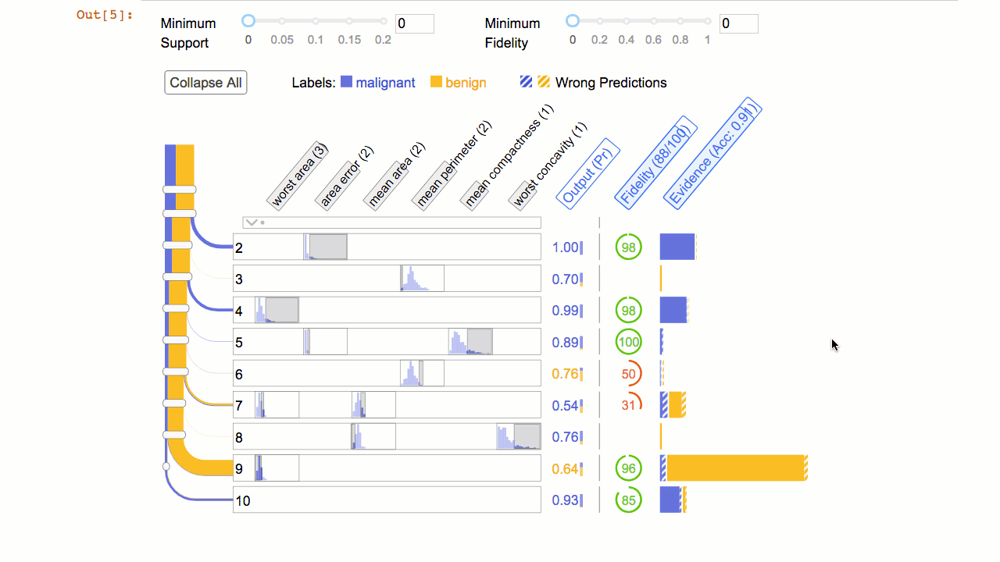

# rule-matrix-py

A model-agnostic tool for explaining machine learning models using rule surrogate and matrix-style visualization.

Check the paper "RuleMatrix: Visualizing and Understanding Classifiers with Rules" for detailed information and technical references.
The preprint pdf can be found on [Arxiv](https://arxiv.org/abs/1807.06228). 
The [published version](https://ieeexplore.ieee.org/document/8440085) can be found on IEEE Explorer.

Basically, RuleMatrix can be used to extract a human-readable rule list that approximate a given classifier. 
For example, we have a neural network trained on the Iris dataset to classify iris plants to three different classes ['setosa', 'versicolor', 'virginica'].
A rule list surrogate of the neural network could be (prob is the probability of the three different classes):

```
     IF (petal length (cm) in (-inf, 2.9799)) THEN prob: [0.9375, 0.0500, 0.0125]

ELSE IF (petal width (cm) in (2.0558, inf)) THEN prob: [0.0200, 0.0200, 0.9600]

ELSE IF (petal length (cm) in (2.9799, 4.7345)) THEN prob: [0.0164, 0.9508, 0.0328]

ELSE DEFAULT prob: [0.0222, 0.1778, 0.8000]
```


# Visualization Demo

Besides the basic rule surrogate algorithm, 
RuleMatrix also provides a visualization toolkit to help you analyze the rules, and the relation between the rules and the original model.

* Example RuleMatrix Visualization:

  

* Example Jupyter [notebook](http://nbviewer.jupyter.org/github/rulematrix/rule-matrix-py/blob/119ae1c631631aebff94080ae04a48e92cbc1bff/notebooks/Test_RuleMatrix_Render.ipynb)

* Online [demo](http://iml-test2.herokuapp.com)

# Install

The code is still under development and is not ready to publish on PyPI.

You can download the code or clone the repository from github by:

```bash
https://github.com/rulematrix/rule-matrix-py.git
```

Then run `pip install -e .` to install the package.

# Usage

## APIs

### rulematrix.Surrogate

The core function of the package is `rulematrix.Surrogate`, which takes a trained teacher model (only use the predict function), and a student model (use RuleList by default).
Then you can use the scikit-learn style API to fit the surrogate model to the provided teacher model on a given training dataset (only provide X).  

```python
import rulematrix
from sklearn.neural_network import MLPClassifier

teacher = MLPClassifier()
# ...code to train the neural net teacher model

surrogate = rulematrix.Surrogate(teacher.predict, student=None, is_continuous=None, is_categorical=None, is_integer=None, 
                                 ranges=None, cov_factor=1.0, sampling_rate=2.0, seed=None, verbose=False)
surrogate.fit(train_x)
print(surrogate.student)
```

You can also checkout the helper function `rulematrix.rule_surrogate`, which makes life easier. 
The usage example can be found at [this notebook](http://nbviewer.jupyter.org/github/rulematrix/rule-matrix-py/blob/119ae1c631631aebff94080ae04a48e92cbc1bff/notebooks/Test_RuleMatrix_Render.ipynb). 

### rulematrix.RuleList

The default student model used by `Surrogate`. 
It inherits from the `BayesianRuleList` of the `pysbrl` to provide functions to handle numeric data automatically.
It will discretize numeric data using a MDLP (Minimum Description Length Principal) discretizer. 
This is because `BayesianRuleList` can only take discreized data as input.

## Visualization

Their are two modes to render the visualization. The first is to use it in a jupyter notebook (recommended), the second is to run a server-client application (with more powerful functions)

### Jupyter Notebook

After installing the package, you can create a jupyter notebook and try out surrogate rules and RuleMatrix visualization easily.
You can check this [example notebook](http://nbviewer.jupyter.org/github/rulematrix/rule-matrix-py/blob/119ae1c631631aebff94080ae04a48e92cbc1bff/notebooks/Test_RuleMatrix_Render.ipynb).

If you are working on the jupyter notebook offline, make sure you set `local=True` when calling the render function `rulematrix.render`.  

### Server-client App

The server code is migrated from [the draft repo](https://github.com/myaooo/x-rule) and is currently under refactoring.
You can check the online demo hosted [here](http://iml-test2.herokuapp.com)


# Development

The package has a few python dependencies: 

* [`pysbrl`](https://github.com/myaooo/pysbrl): A python wrapper for the SBRL (Scalable Bayesian Rule List). 
   To utilize fast bit operations, SBRL is written in C to make the training of rule list faster.
* [`mdlp-discretization`](https://github.com/myaooo/mdlp-discretization): A Cython pacakge for discretizing numeric data using MDLP.
* [`pyfim`](http://www.borgelt.net/pyfim.html): A pacakge that implements different frequent itemset mining algorithms.

Since `pysbrl` and `mdlp-discretization` are still under developing, there can appear compatibility issues between `rulematrix` and these packages.
Raise an issue here or at these packages if there is bugs. 


## Note

A draft version is originally hosted at:

https://github.com/myaooo/x-rule

The code in this repo is under active development, APIs are redesigned.

## Citing RuleMatrix

```
@ARTICLE{ming18, 
author={Yao Ming and Huamin Qu and Enrico Bertini}, 
journal={IEEE Transactions on Visualization and Computer Graphics}, 
title={RuleMatrix: Visualizing and Understanding Classifiers with Rules}, 
year={2018}, 
volume={}, 
number={}, 
pages={1-1}, 
keywords={Machine learning;Data visualization;Visualization;Neural networks;Decision trees;Data models;Support vector machines;explainable machine learning;rule visualization;visual analytics}, 
doi={10.1109/TVCG.2018.2864812}, 
ISSN={1077-2626}, 
month={},}
```
